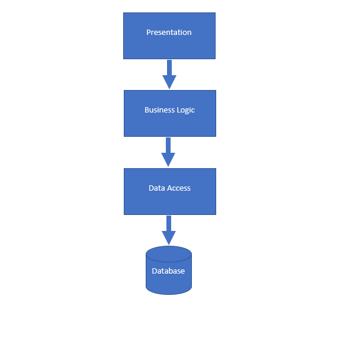

# Software engineering

### Topics
- Application architecture
    - Client/Server
    - HTTP and ReST
    - Layered architecture
- Object-oriented programming
    - strongly typed language
    - information hiding
    - interfaces
    - dependency injection
    - polymorphism


## Application architecture

### Client/Server
- Two applications communicate, mostly over a network
- Client sends a request
- Server returns a response
- Well defined protocol
    - proprietary
    - open

### HTTP and ReST
- Representational State Transfer
- Resource oriented
    - `/customer/1234/invoices/9832`
- use of features of http
    - http verbs (GET, POST, PUT, DELETE, OPTIONS, etc.)
    - stateless
    - http body for payload
    - query parameter for queries

### HTTP anatomy (1)
#### Anatomy of an URL (universal resource locator)

```
              host
               |
         /-------------\ 
https://api.example.com/customer?orderby=name&take=10
\___/   \_/ \_____/ \_/ \______/ \__________________/
  |      |      |     \    |          |
scheme   |    domain   \  path      query
       subdomain    top level domain
```

### HTTP anatomy (2)
#### Request
- Request line
- Zero or more headers
- An empty line
- An optional body

#### Example
```
POST /customer HTTP/1.1
Host: api.example.com
Content-Type: application/json

{
  "firstName": "Eric",
  "lastName": "Idle"
}
```

### HTTP verbs to manipulate resources
- `GET`
    - no body
    - read resources
    - query parameters
- `POST`
    - body
    - sending data to the server
    - creates a sub-resorce
- `PUT`
    - body
    - sending data to the server
    - places or replaces a resource
- `DELETE`
    - no body
    - removes a resource


### Reading resources
- `GET /customers/` 
    - all customers
- `GET /customers?nameStartsWith=eric` 
    - filters the customers 
- `GET /customers/1234` 
    - customer with id `1234`
- `GET /customers/1234/invoices` 
    - all invoices of customer `1234`
- `GET /customers/1234/invoices/9832` 
    - invoice `9832` of customer `1234`


### `POST` (create)
#### `POST /customers/` 
- creates a new resource under `/customers` 
    - e.g `customers/2234`
- returns status code `201 created`
- returns header `Location: /customers/3134`

### `PUT` (create/update)
#### `PUT /customers/1234`
- replaces the resource `/customers/1234`
- creates it, if it doesn't exist 
- returns status code `204 No Content`

### `DELETE` (delete)
#### `DELETE /customers/1234`
- deletes the resource `/customers/1234`
- returns status code `204 No Content`


### Layered application (1)


### Layered application (2)

#### Presentation layer
Presents the data

- Userinterface
- API for other applications

#### Business logic layer
Handles to business logic

- Business rules
- Calculations

#### Data access layer
Manages the data

- Abstraction to the data source
    - database
    - file
    - other application (e.g web interface)

## Object-oriented programming
### Type system

#### Loosley typed (JS)
```js
function multiply(x, y) {
  return x * y;
}

multiply("a", "b") // <-- returns NaN
```

#### Strongly typed (C#)
```cs
public int Multiply(int x, int y)
{
  return x * y;
}

Multiply("a", "b"); // <-- doesn't compile
```

### Types
#### Simple types (value types)
- bool
- byte (8 bit)
- short (16 bit)
- int (32 bit)
- long (64 bit)
- float (32 bit)
- double (64 bit)
- decimal (128 bit)
- char (character, 16 bit)

#### Class types (reference types)
- object
- string

### Classes and objects
#### Class
- Template
- Defines datastructures and functionality

#### Object
- Concrete instance of a class

#### Example
```cs
public class Circle
{
  public double Radius { get; set; }
  public double CalculateArea() 
  {
    return Radius ^ 2 * Math.PI
  }
}
```

### Information hiding
```cs
public class Employee
{
  private double _salary;
  public double Salary 
  {
    get => _salary;
    set 
    {
      if (value < 4000) _salary = 4000;
      else _salary = value;
    }
  }
}
```

### Access modifiers
- **`public`**: Accessible for everybody
- **`private`**: Accessible only inside the class
- **`protected`**: Accessible for derived classes
- **`internal`**: Accessible for code inside the same assembly

### Encapsulation
```cs
public class EmailService
{
  public void Create(string email)
  {
    if (ValidateEmail(email)) _emailRepo.Create(email);
  }

  public void Update(string email)
  {
    if (ValidateEmail(email)) _emailRepo.Update(email);
  }

  private bool ValidateEmail(string email) 
    => email.Contains("@");
}
```

### Abstractions
#### Interfaces
- Contract, without implementation
- Define members and method signatures
- Classes can implement multiple interfaces

#### Abstract classes
- Contract with (default) implementation
- Define members and method signatures
- Classes can only inherit from one class

### Interface example
```cs
public interface IEmailService
{
  void Create(string email);
}

public class EmailService : IEmailService
{
  public void Create(string email)
  {
    if (ValidateEmail(email)) _emailRepo.Create(email);
  }
}
```

### Interface example (cont.)
```cs
public class InMemoryEmailService : IEmailService
{
  public void Create(string email)
  {
    if (ValidateEmail(email)) _emailList.Add(email);
  }
}
```

### Interface usage
```cs
public class CreateEmailView
{
  private IEmailService _emailService;

  public CreateEmailView(IEmailService emailService) 
  {
    _emailService = emailService;
  }
}
```

### Abstract classes example
#### Definition
```cs
public class BaseEmailService
{
  public abstract void Create(string email);

  protected bool ValidateEmail(string email) 
    => email.Contains("@");
}
```
#### Implementation
```cs
public class EmailService : BaseEmailService
{
  public override void Create(string email)
  {
    if (ValidateEmail(email)) _emailRepo.Create(email);
  }
}
```

### Composition over inheritance
- Inheritance creates a tight coupling between classes
    - Changes in one module can cause changes in the other
    - They depend on each other
    - Modules are harder to reuse or test
- Composition creates new functionality by reusing existing functionality

### Decorator
#### Interface
```cs
public interface IEmailService
{
  void Create(string email);
}
```

#### Base implementation
```cs
public class EmailService : IEmailService
{
  public void Create(string email)
  {
    _emailRepo.Create(email);
  }
}
```

### Decorator (cont.)
#### Decorator class
```cs
public class ValidatedEmailService : IEmailService
{
  private IEmailService _emailService;
  public ValidatedEmailService(IEmailService emailService) 
  {
    _emailService = emailService;
  }

  public void Create(string email)
  {
    if (ValidateEmail(email)) _emailService.Create(email);
  }

  private bool ValidateEmail(string email) 
    => email.Contains("@");
}
```

### Decorator (cont.)
#### Decorator class
```cs
public class ValidatedEmailService : IEmailService
{
  private IEmailService _emailService;
  private IEmailValidator _emailValidator;
  public ValidatedEmailService(IEmailService emailService, 
    IEmailValidator emailValidator) 
  {
    _emailService = emailService;
    _emailValidator = emailValidator;
  }
  public void Create(string email)
  {
    if (_emailValidator.ValidateEmail(email)) 
      _emailService.Create(email);
  }
}
```
